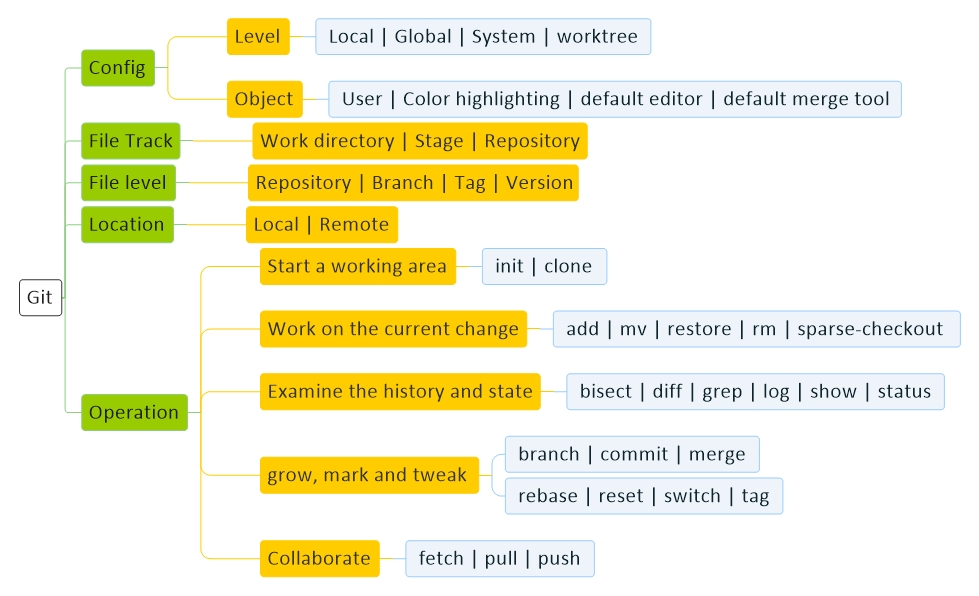

<!---------------------------------------[Description]-->
## Description
    This is a example of git

<!---------------------------------------[Diagram]-->
  

## Diagram

<!---------------------------------------[Concept]-->
  

## Concept 

گیت یک مخزن (repository) می سازه که از سه لایه منطقی به فایل ها نگاه میکنه :
 
1 – لایه اول یا همان (working tree) که هنوز اقدامی برای ثبت تغییرات انجام نشده و فایل ها در حال تغییر هستند 
 
2 – لایه دوم یا همان (stage)که با وارد کردن فایل ها به این لایه، آنها آماده ثبت تغییر می شوند
 
3 – لایه سوم (Repository) که تمام تغییرات فایل ها ثبت می شوند

<!---------------------------------------[Source]-->
  

## Source

#### General
<a href="http://git-scm.com" target="_blank">git-scm</a> - 
<a href="http://github.com" target="_blank">github</a> - 
<a href="http://gitlab.com" target="_blank">gitlab</a>

#### Tutorial
<a href="http://faradars.org" target="_blank">faradars</a> - 
<a href="http://roocket.ir" target="_blank">roocket</a> - 
<a href="http://clicksite.org" target="_blank">clicksite</a> - 
<a href="http://faranesh.com" target="_blank">faranesh</a> -
<a href="https://gitexplorer.com/" target="_blank">gitexplorer</a> 

<!---------------------------------------[Install]-->
  

## Install

#### Mac
    brew install git

#### Ubuntu
    sudo apt install git-core
    sudo apt install git-all

#### Windows (Someone who uses the Linux will have steps with confidence and authority)
    ...

<!---------------------------------------[Tools]-->
  

## Tools
    Ohmyzsh : graphic for git

<!---------------------------------------[Question]-->
  

## Question

    0 - git chi hast ?
    1 - structure git chi hast??
    2 - chegone yek project dar website gite create konam ?
    3 - chegone computere khodam ro be github az tarigh key vasl konam ke hey user pass nazanam ?
    4 - chegone project ro az github be dakhele computeram biaram ?
    5 - agar yek project public bashad va yeki bere clone kone va change kone va commit cone to pc khodesh, bad age push kone ro remote yani github aya save mishe ?
    6 - 

